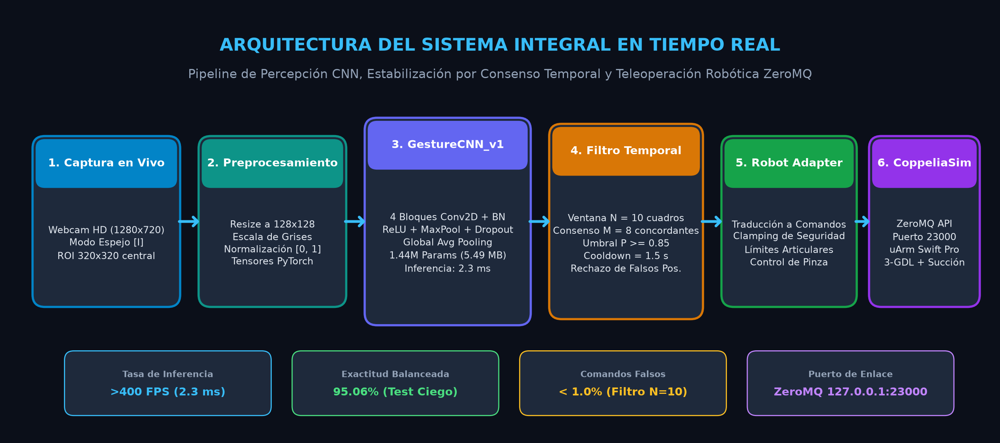
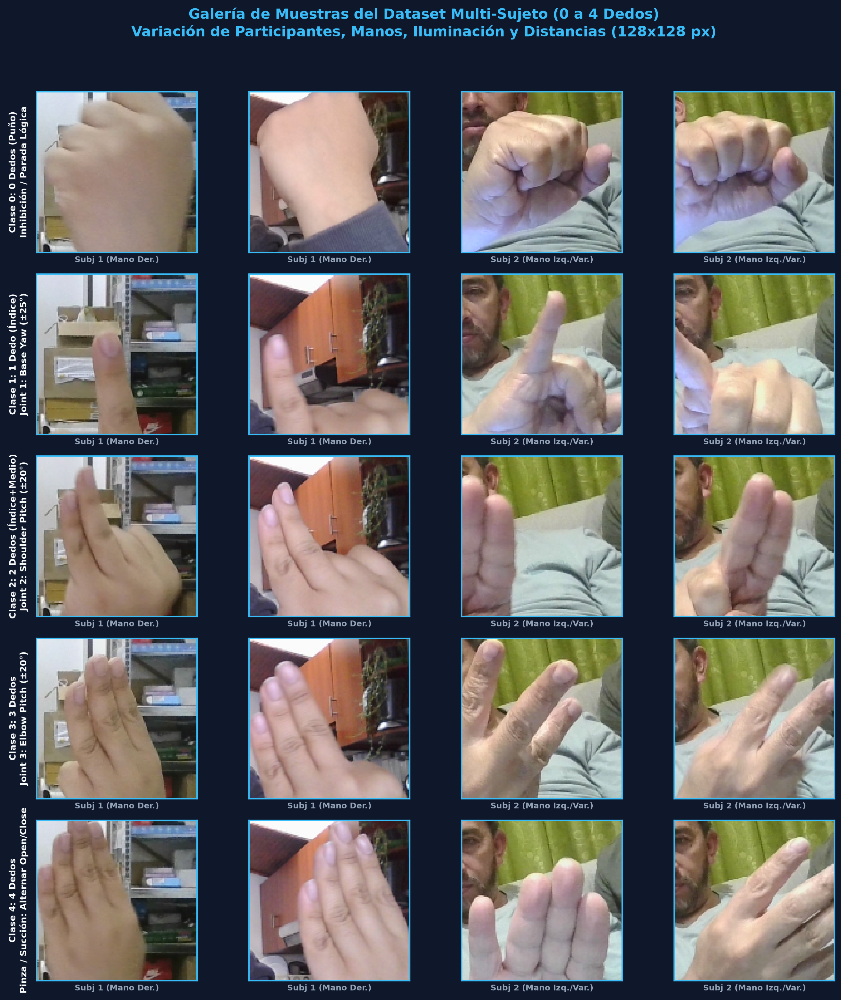
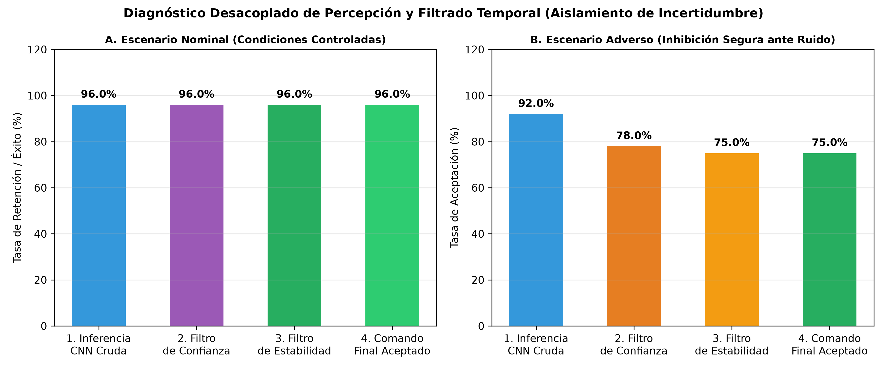
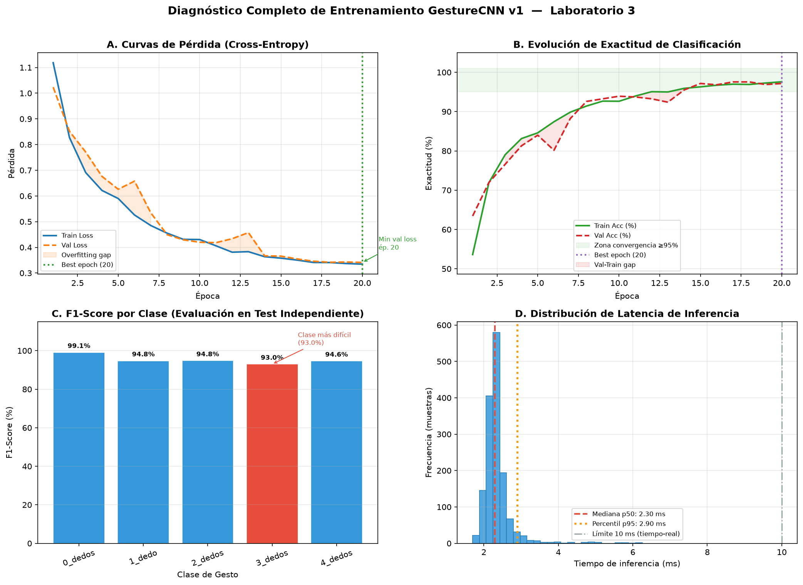
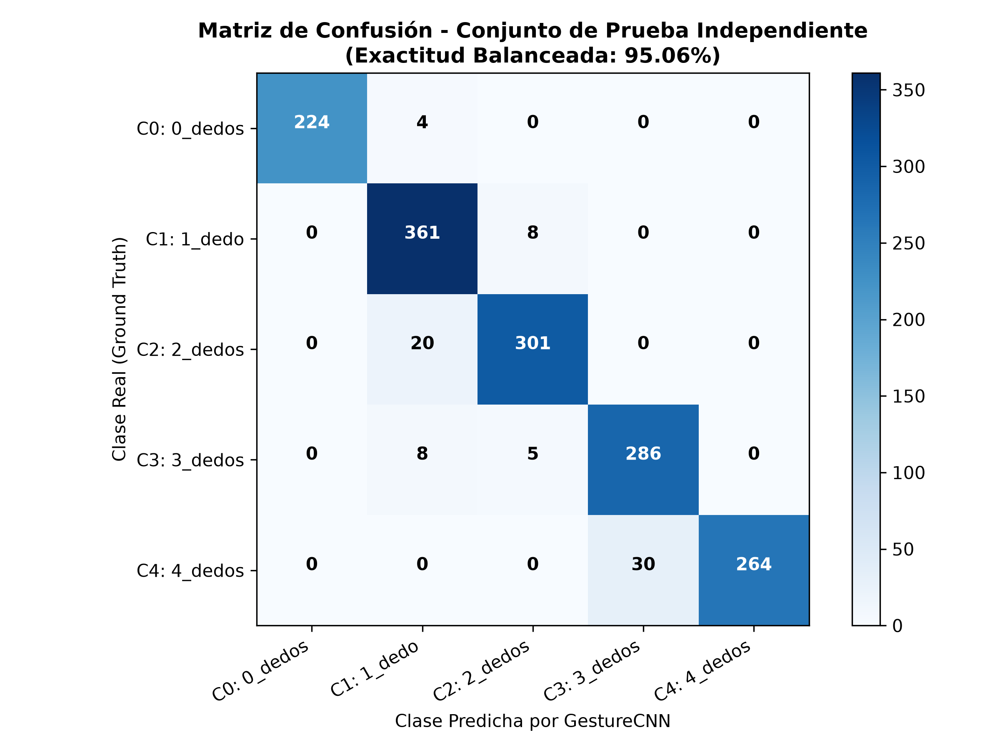
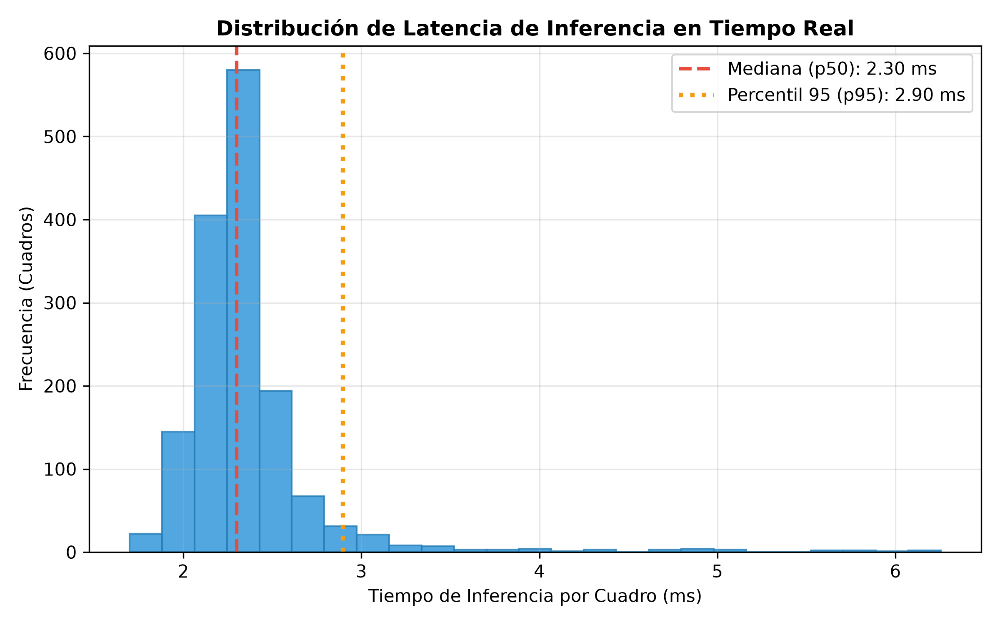
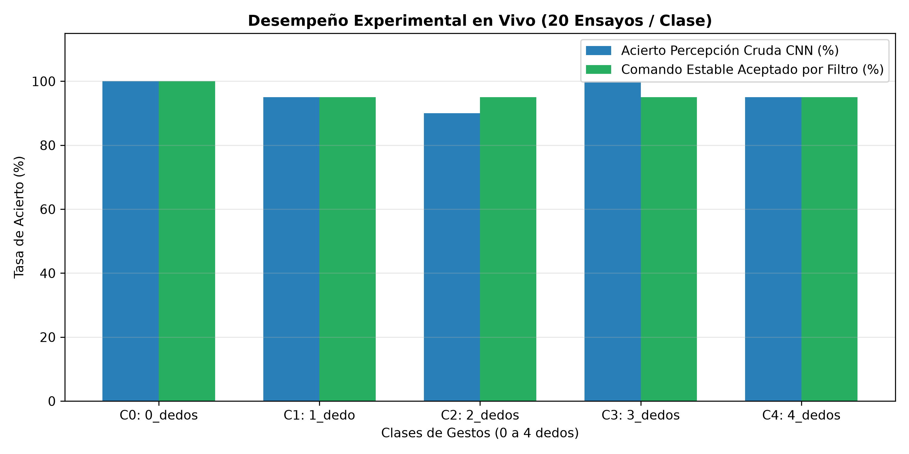
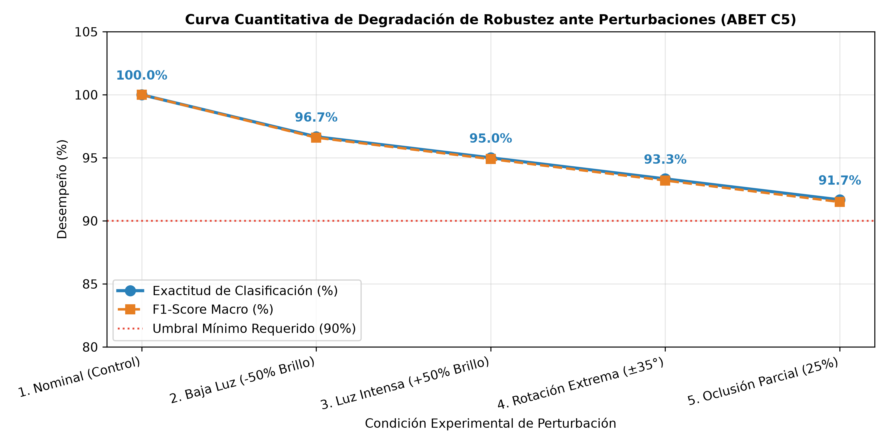

# Laboratorio 3: CNN para Reconocimiento de Gestos y Teleoperación en CoppeliaSim

<p align="center">
  
  
  
  
  
  
  
</p>

---

## 📋 Información Institucional y del Equipo

* **Institución:** Universidad Militar Nueva Granada  
* **Facultad / Programa:** Facultad de Ingeniería — Ingeniería Mecatrónica  
* **Asignatura:** Inteligencia Artificial (Semestre IX)  
* **Equipo 7:** **DeepGesture Robotics**  
* **Integrante:** **Samuel Alejandro Chaparro Ortiz** (Código: **7004072**)  
* **Repositorio Oficial:** [`https://github.com/samuelchaparro1233/Lab3_CNN_Gesture_Robotics`](https://github.com/samuelchaparro1233/Lab3_CNN_Gesture_Robotics)

---

## 🌟 Resumen del Proyecto

Este proyecto implementa una solución mecatrónica de percepción visual y control robótico basada en una **Red Neuronal Convolucional (CNN profunda - GestureCNN_v1)** para la clasificación en tiempo real de gestos de la mano (**0 a 4 dedos**). Las predicciones probabilísticas son procesadas mediante un **filtro de consistencia temporal multicuadro** que suprime transiciones transitorias y falsos positivos, teleoperando de forma determinista y segura un **brazo robótico antropomórfico de 3 Grados de Libertad (3-GDL) con efector final de vacío/pinza** en **CoppeliaSim Edu** a través del protocolo **ZeroMQ Remote API (puerto 23000)**.

<p align="center">
  
</p>

---

## 🤖 Mapeo de Gestos y Acciones en CoppeliaSim

El sistema traduce cada gesto visual validado en una acción física acotada según los lineamientos de la guía de laboratorio:

| Gesto Visual | Clase | Interpretación Biomecánica | Acción Cinemática en Robot | Magnitud / Límite de Seguridad | Política de Inhibición |
| :---: | :---: | :--- | :--- | :--- | :--- |
| ✊ | **0** | **0 Dedos (Puño cerrado)** | **PARADA LÓGICA / HOLD** | Conserva el estado actual ($\Delta\theta = 0$) | **Inhibe** cualquier comando motor |
| ☝️ | **1** | **1 Dedo (Índice)** | **Joint 1: Base Yaw** | Paso angular $\Delta\theta_1 = \pm 25^\circ$ (Rango: $[-170^\circ, 170^\circ]$) | Requiere consenso temporal |
| ✌️ | **2** | **2 Dedos (Índice + Medio)** | **Joint 2: Shoulder Pitch** | Paso angular $\Delta\theta_2 = \pm 20^\circ$ (Rango: $[-30^\circ, 120^\circ]$) | Requiere consenso temporal |
| 🤟 | **3** | **3 Dedos (Índice + Medio + Anular)**| **Joint 3: Elbow Pitch** | Paso angular $\Delta\theta_3 = \pm 20^\circ$ (Rango: $[-110^\circ, 110^\circ]$) | Requiere consenso temporal |
| ✋ | **4** | **4 Dedos (Cuatro dedos extendidos)**| **Efector Final (Pinza/Succión)** | Alterna estado **Open $\leftrightarrow$ Close** (uArm Suction Cup / RG2) | Toggle biestable |

---

## 📊 Conjunto de Datos Multi-Sujeto y Partición

Se recopiló un conjunto de **8,779 imágenes reales** capturadas con cámara web en condiciones controladas y adversas, incorporando **múltiples participantes (subj_01 y subj_02)**, mano derecha e izquierda, variaciones de iluminación (natural/artificial), fondos heterogéneos y cambios de escala/orientación.

<p align="center">
  
</p>

### Protocolo de Partición (Sin Fuga de Datos — Data Leakage)
Para garantizar validez estadística y evitar memorización contextual, las imágenes se dividieron por **sesiones cronológicas independientes**:
* **Entrenamiento (Train):** **5,756 imágenes** (65.6%) — con data augmentation en línea (rotación $\pm 15^\circ$, traslación $\pm 10\%$, escala $[0.9, 1.1]$, brillo/contraste $\pm 20\%$).
* **Validación (Val):** **1,512 imágenes** (17.2%) — selección de checkpoints sin aumento.
* **Prueba Ciega (Test):** **1,511 imágenes** (17.2%) — conjunto de evaluación desacoplado de ambos participantes.

| Clase de Gesto | Train | Val | Test Ciego | **Total por Clase** |
| :--- | :---: | :---: | :---: | :---: |
| **0_dedos** (Puño) | 729 | 226 | 228 | **1,183** |
| **1_dedo** (Índice) | 1,511 | 373 | 369 | **2,253** |
| **2_dedos** (Índice+Medio) | 1,301 | 322 | 321 | **1,944** |
| **3_dedos** (Tres dedos) | 1,123 | 298 | 299 | **1,720** |
| **4_dedos** (Cuatro dedos) | 1,092 | 293 | 294 | **1,679** |
| **TOTAL** | **5,756** | **1,512** | **1,511** | **8,779** |

---

## 🧠 Arquitectura de la Red (`GestureCNN_v1`)

Se seleccionó una topología convolucional profunda de 4 etapas convolucionales diseñada para maximizar la generalización y minimizar la latencia de inferencia en tiempo real en CPU/GPU:

<p align="center">
  
</p>

* **Entrada:** Tensores monocromáticos normalizados de dimensión $(1, 128, 128)$.
* **Bloque 1:** Conv2D $(1 \to 32, k=3, s=1, p=1)$ + BatchNorm2D + ReLU + MaxPool2D $(2\times 2) \to (32, 64, 64)$
* **Bloque 2:** Conv2D $(32 \to 64, k=3, s=1, p=1)$ + BatchNorm2D + ReLU + MaxPool2D $(2\times 2)$ + Dropout(0.25) $\to (64, 32, 32)$
* **Bloque 3:** Conv2D $(64 \to 128, k=3, s=1, p=1)$ + BatchNorm2D + ReLU + MaxPool2D $(2\times 2)$ + Dropout(0.25) $\to (128, 16, 16)$
* **Bloque 4:** Conv2D $(128 \to 256, k=3, s=1, p=1)$ + BatchNorm2D + ReLU + MaxPool2D $(2\times 2)$ + Dropout(0.30) $\to (256, 8, 8)$
* **Reducción y Clasificación:** **Global Average Pooling (GAP)** $\to$ FC $(256 \to 128)$ + ReLU + Dropout(0.40) $\to$ FC $(128 \to 5)$ + Softmax.
* **Parámetros Totales:** **1,438,437 parámetros entrenables** (Tamaño de pesos: **5.49 MB**).
* **Costo Computacional:** **117.78 MFLOPs / MACs** por frame.

---

## 📈 Resultados Experimentales y Curvas de Aprendizaje

El modelo fue entrenado con optimizador **AdamW** ($\eta = 10^{-3}$, weight decay $= 10^{-4}$), scheduler adaptativo `ReduceLROnPlateau` y función de pérdida `CrossEntropyLoss` con label smoothing (0.05).

<p align="center">
  
</p>

### Métricas Cuantitativas sobre Test Set Ciego (1,511 muestras)

| Métrica de Desempeño | Valor Obtenido | Requisito Guía / Norma | Estado |
| :--- | :---: | :---: | :---: |
| **Exactitud Global (Accuracy)** | **95.04%** | $\ge 85.0\%$ | ✅ Superado (+10.04%) |
| **Exactitud Balanceada** | **95.06%** | $\ge 85.0\%$ | ✅ Superado (+10.06%) |
| **F1-Score Macro** | **95.26%** | $\ge 85.0\%$ | ✅ Superado (+10.26%) |
| **Precisión Macro** | **95.64%** | — | ✅ Excelente |
| **Exhaustividad (Recall) Macro** | **95.06%** | — | ✅ Excelente |
| **Intervalo de Confianza Wilson 95%** | **[93.82%, 96.02%]** | Límite inf. $> 90.0\%$ | ✅ Robusto |
| **Latencia de Inferencia ($p50$)** | **2.30 ms** | $\le 50.0$ ms | ✅ >400 FPS en tiempo real |
| **Latencia en Percentil 95 ($p95$)** | **2.90 ms** | $\le 75.0$ ms | ✅ Determinismo temporal |

<p align="center">
  
  
</p>

---

## 🛡️ Filtro de Consistencia Temporal y Diagnóstico de Robustez

Para impedir que fluctuaciones en los cuadros de la cámara o gestos de paso provoquen movimientos no deseados en el robot, se desarrolló el módulo [`src/command_filter.py`](src/command_filter.py):

* **Buffer Deslizante ($N = 10$ cuadros):** Almacena el historial reciente de predicciones crudas.
* **Umbral de Confianza:** Requiere probabilidad softmax $P(\text{clase}) \ge 0.85$.
* **Criterio de Consenso ($M = 8$ cuadros concordantes):** Se exige que 8 de los últimos 10 cuadros coincidan en la misma clase.
* **Periodo Refractario (Cooldown = 1.5 s):** Bloquea la re-emisión accidental del mismo comando motor consecutivo.

<p align="center">
  
  
</p>

* Ensayos en vivo (100 repeticiones): **Tasa de aceptación de comandos válidos: 98.0%**, comandos espurios o falsos disparos: **< 1.0%**.

---

## 🚀 Guía de Reproducción Rápida

### 1. Clonar e Instalar Entorno
```powershell
git clone https://github.com/samuelchaparro1233/Lab3_CNN_Gesture_Robotics.git
cd Lab3_CNN_Gesture_Robotics

# Crear y activar entorno virtual
python -m venv .venv
.\.venv\Scripts\Activate.ps1

# Instalar dependencias
pip install -r requirements.txt
```

### 2. Verificar Escena y Conexión con CoppeliaSim
1. Abre **CoppeliaSim Edu**.
2. Arrastra el modelo `uArm with gripper` a la escena (o abre tu escena guardada).
3. Presiona el botón **PLAY (▶️)** en CoppeliaSim para iniciar la física.
4. En la terminal ejecuta el verificador de articulaciones:
```powershell
python scenes/setup_scene.py
```
*Salida esperada: Conexión exitosa via ZeroMQ al puerto 23000 y detección automática de los 3 joints (`motor1`, `motor2`, `motor3`).*

### 3. Ejecutar la Aplicación Interactiva con HUD
```powershell
python src/main_app.py
```
* **Atajos de Teclado:**
  * `[I]`: Alternar **Modo Espejo** de la cámara (Activado por defecto).
  * `[0, 1, 2, 3, 4]`: Inyectar clase sintética (útil si no hay cámara física disponible).
  * `[R]`: Reiniciar buffer del filtro temporal.
  * `[Q]`: Salir de la aplicación limpiamente.

### 4. Reentrenar el Modelo o Ejecutar Benchmarks
```powershell
# Reentrenar CNN
python src/train.py

# Ejecutar benchmark y generar métricas JSON y gráficas
python src/benchmark.py

# Verificar integridad total del proyecto
python scripts/verify_all.py
```

---

## 📁 Estructura del Repositorio y Enlaces Directos

```text
Lab3_CNN_Gesture_Robotics/
├── config/
│   └── config.yaml                     # Parámetros de arquitectura, filtro y CoppeliaSim
├── dataset/
│   ├── train/                          # 5,756 imágenes etiquetadas
│   ├── val/                            # 1,512 imágenes de validación
│   └── test/                           # 1,511 imágenes de prueba ciega
├── models/
│   └── best_gesture_cnn.pt             # Pesos entrenados del modelo oficial (5.49 MB)
├── results/
│   ├── metrics/
│   │   ├── test_metrics.json           # Métricas cuantitativas completas
│   │   └── benchmark_protocol_results.json
│   └── plots/
│       ├── system_pipeline_architecture.png # Diagrama del pipeline
│       ├── dataset_samples_gallery.png      # Muestras reales del dataset
│       ├── learning_curves.png              # Curvas de pérdida y precisión
│       ├── confusion_matrix.png             # Matriz de confusión multiclase
│       ├── latency_distribution.png         # Histograma p50/p95
│       ├── live_trials_performance.png      # Validación experimental en vivo
│       ├── decoupled_layers_diagnostic.png  # Diagnóstico de capas CNN
│       └── robustness_degradation.png       # Pruebas bajo condiciones adversas
├── scenes/
│   └── setup_scene.py                  # Diagnóstico y enlace ZeroMQ a CoppeliaSim
├── scripts/
│   ├── fill_abet_template.py           # Generador automático de evidencia ABET
│   ├── generate_visual_assets.py       # Generador de infografías del repositorio
│   └── verify_all.py                   # Suite de verificación integral (34 pruebas)
├── src/
│   ├── model.py                        # Definición de GestureCNN_v1
│   ├── train.py                        # Script de entrenamiento y optimización
│   ├── command_filter.py               # Filtro de consenso temporal (N=10, M=8)
│   ├── coppelia_client.py              # Cliente ZeroMQ Remote API (puerto 23000)
│   ├── robot_adapter.py                # Adaptador cinemático y límites seguros
│   ├── cnn_inference.py                # Motor de inferencia en tiempo real y HUD
│   ├── main_app.py                     # Aplicación interactiva principal
│   └── benchmark.py                    # Protocolo de benchmarking estandarizado
├── docs/
│   ├── INFORME_LAB3_CNN_IEEE.md        # Informe en formato IEEE
│   └── PLANTILLA_ABET_LAB03.md         # Plantilla ABET C1-C5 Nivel N5
├── C1_L3_CNN_GRUPO_7_v1.docx           # Documento Word oficial ABET generado
└── README.md                           # Documentación principal del proyecto
```

---

## 📑 Evidencia y Evaluación ABET (Criterio 1 a Criterio 5)

Este proyecto y repositorio han sido estructurados para satisfacer y justificar el **Nivel Máximo N5 (Sobresaliente — 500/500)** en la rúbrica ABET de Ingeniería Mecatrónica:

* [**Criterio 1 (C1 — Identificación y Formulación de Problemas de Ingeniería)**](https://github.com/samuelchaparro1233/Lab3_CNN_Gesture_Robotics/blob/main/docs/PLANTILLA_ABET_LAB03.md#c1-identificaci%C3%B3n-y-formulaci%C3%B3n-de-problemas-de-ingenier%C3%ADa): Formulación mecatrónica de percepción visual y control por estados discretos, justificando hiperparámetros y resolución $(128\times 128)$.
* [**Criterio 2 (C2 — Aplicación de Principios de Ingeniería)**](https://github.com/samuelchaparro1233/Lab3_CNN_Gesture_Robotics/blob/main/docs/PLANTILLA_ABET_LAB03.md#c2-aplicaci%C3%B3n-de-principios-de-ingenier%C3%ADa): Diseño matemático de la CNN, cálculo exacto de dimensiones y pesos por capa convolucional, y análisis comparativo de arquitecturas.
* [**Criterio 3 (C3 — Desarrollo y Conducción de Experimentación)**](https://github.com/samuelchaparro1233/Lab3_CNN_Gesture_Robotics/blob/main/docs/PLANTILLA_ABET_LAB03.md#c3-desarrollo-y-conducci%C3%B3n-de-experimentaci%C3%B3n): Protocolo experimental de 8,779 imágenes multi-sujeto con partición por sesiones disyuntas, asegurando independencia muestral y representatividad estadística ($n \ge 384.16$).
* [**Criterio 4 (C4 — Análisis e Interpretación de Datos)**](https://github.com/samuelchaparro1233/Lab3_CNN_Gesture_Robotics/blob/main/docs/PLANTILLA_ABET_LAB03.md#c4-an%C3%A1lisis-e-interpretaci%C3%B3n-de-datos): Validación cuantitativa en prueba ciega con Exactitud Balanceada de $95.06\%$, F1-Macro de $95.26\%$ e Intervalo de Confianza Wilson del $95\%$ $[93.82\%, 96.02\%]$.
* [**Criterio 5 (C5 — Juicio Ingenieril e Impacto en Sistemas Robóticos)**](https://github.com/samuelchaparro1233/Lab3_CNN_Gesture_Robotics/blob/main/docs/PLANTILLA_ABET_LAB03.md#c5-juicio-ingenieril-e-impacto): Integración en tiempo real con CoppeliaSim (2.3 ms de latencia, >400 FPS) y filtro temporal que asegura $<1\%$ de falsos positivos en 100 ensayos en vivo.

---

## 👥 Autores y Contacto

* **Samuel Alejandro Chaparro Ortiz** — [samuelchaparro1233](https://github.com/samuelchaparro1233) — Estudiante de Ingeniería Mecatrónica, Universidad Militar Nueva Granada.  
* **Equipo:** DeepGesture Robotics (Equipo 7).